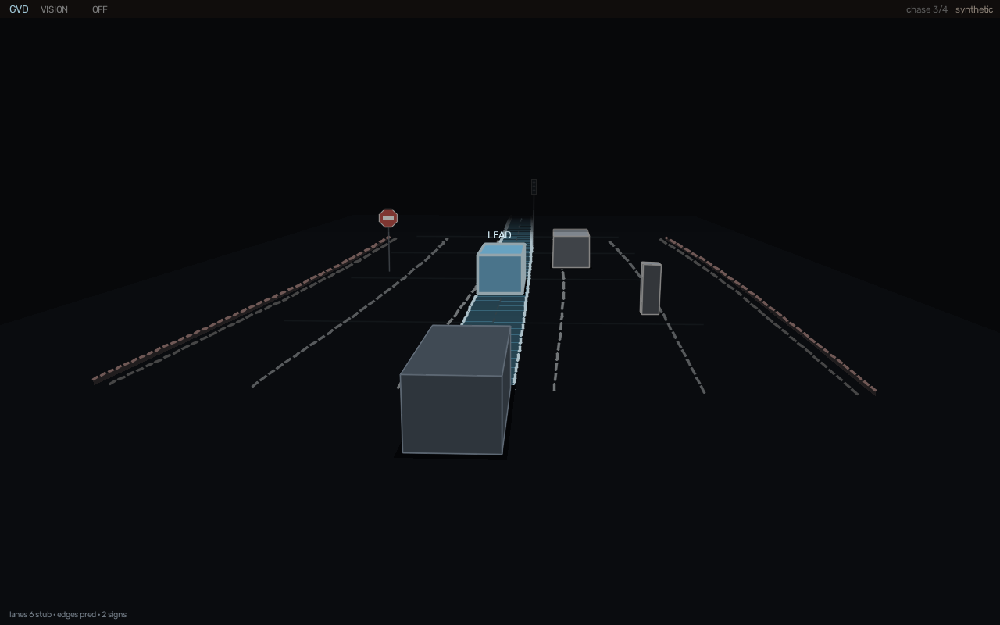
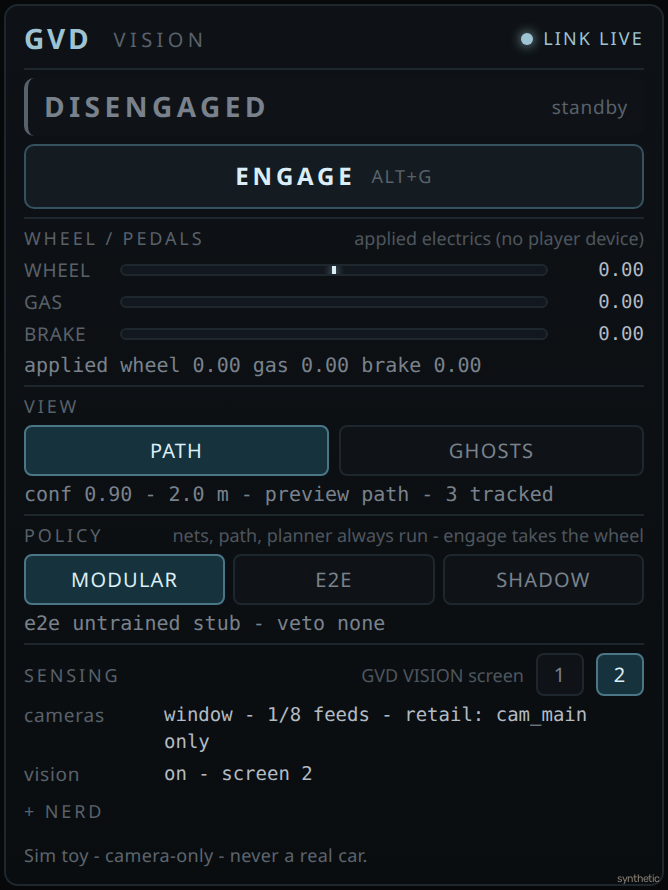
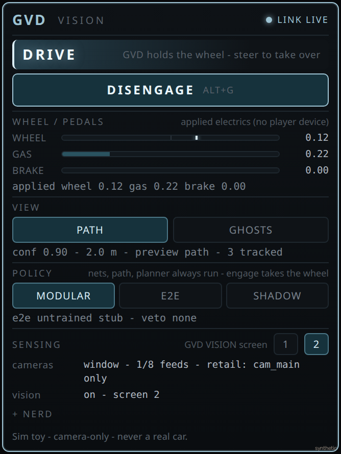

# Grok Vision Drive (GVD)

Public **MIT** BeamNG.drive / BeamNG.tech **camera-only** self-driving **toy** inspired by Tesla FSD *software strategies* — not a clone, not a Tesla product, and **not** real-vehicle control.

Entertainment only. Never use this stack to control a physical car.

First-time clone: point [Grok Build](https://x.ai/cli), Grok Bot, or any computer-use agent at this repo on extra-high reasoning — paste [`AGENTS.md`](AGENTS.md) if the tool does not auto-read the tree. Have it install GVD on this PC, probe or accept the specs, pick **retail** window-capture vs BeamNG.**tech** 8-cam from what is actually installed, and patch [`config/hardware.yaml`](config/hardware.yaml) to that GPU / VRAM / RAM. No step-by-step here — the model can open the project.

## Alpha 1.0.1

This is **alpha** — may break / not work; improves with fixes.

Canonical pin **1.0.1** (`VERSION`, `python/__init__.py`, BeamNG `app.json`). Untagged retail zips use `1.0.1-alpha-<sha>`.

**Versioning** (this line stays **alpha** until a later non-alpha release):

- **point** bumps (`1.0.x`) = fixes / small UI
- **main alpha** bump (`1.x.0`) = features / core / UI overhaul

## Recent changes (alpha 1.0.1)

Point bump: bus safety fixes and a small HUD polish. Live Alt+G, Tech 8-cam, FFB, and QSV stay **UNPROVEN**.

Architecture

- A leftover `gvd_engage.json` `engaged:true` does not start the car. Python honors that flag only while its `mtime` is about 2.5 s fresh. Lua refreshes the stamp every 0.5 s while the in-game latch is on, and will not write `true` over a newer supervisor `false`.
- Engage still starts only in the game (Alt+G or the app button). A file cannot turn it on.
- `--policy e2e` with no `models/e2e_current.onnx` holds the brake (`veto:e2e_stub`) and stays engaged. Shadow keeps the modular command.
- `cmd_applied` is true only when the Lua ack is this `seq` or up to 5 behind. An old high `applied_seq` is not an ack.
- Retail stays one window (`cams=1/8`). Tech 8-cam is still the other product. `--backend auto` still does not pick Tech because `beamngpy` imports.

UI

- The app, the strip, and the GVD VISION title share one glance word: OFF / ON / HOLD / DRIVE / MISMATCH. HOLD is a brake hold (preview, veto, AEB, untrained e2e, or a link that is not live). DRIVE means a command is actually applied.
- The default app stays 330×440. The bus folder moved into `+ nerd`. The toy footer stays pinned on that tile.
- The strip uses ice when on or driving, amber on HOLD, and red on MISMATCH.
- Key `0` still hides nerd chrome. The title word stays, because that bar is already on the clean cabin.
- Cabin agent boxes are empty solids. LEAD and BRAKE stay. The forecast is a thin ice line that starts half a length ahead of the track and is drawn under the box, so the face has no disc and no bright center mark. Occupancy and planner samples stay on nerd layers `1–5`.

## Honesty (M0)

- **Vision only** at inference: RGB cameras + ego kinematics + GPS as a **nav hint**. Optional pin (`nav.pin_lat` / `nav.pin_lon` in `config/tech.yaml`, or `GVD_NAV_PIN_LAT` / `GVD_NAV_PIN_LON`) is **not a route** — `nav.mode=hint`, `drive_to_pin=false`, and the corridor planner ignores the pin.
- **Optional extras** (`config/sensors.yaml`): IMU + GPS on by default; LiDAR / radar / lidar_lua / Foxglove **off**. They are a **sensor bus** (Foxglove / future fusion only) — they never feed `ModularPerception` or the planner. Ultrasonic / IdealRadar stay refused. See [Extra sensors / Foxglove](#extra-sensors--foxglove).
- **Dev / Tech path** (preferred): BeamNGpy Camera sensors, 8-cam rig, BeamNGpy `vehicle.control`. Engaged hold/stop/AEB: `set_shift_mode("realistic_automatic")` + `gear=0` (int, never `-1` / never `"D"`) + `brake=1` ± `parkingbrake`. Forward only with `gear>=1` and throttle>0. **Player / Drive (retail)**: window-capture fallback for a **single** main view (`cams=1/8`) — do not pretend that is 8 cameras. Retail **drives** through the mod: Python writes `Documents/GVD/gvd_cmd.json`, GELua applies it as a **secondary Direct Drive wheel + pedals** (`input.event(..., FILTER_DIRECT, source=gvd)` plus `setAllowedInputSource` so a connected keyboard/pad/wheel/pedal cluster cannot overwrite the software), and echoes speed/inputs back via `gvd_ego.json`. Retail still zeros `parkingbrake` so a resting handbrake cannot pin the car (unchanged this hotfix).
- Default GPU profile: **NVIDIA GTX 1080 Ti (11 GB)** — **mid** in [`config/hardware.yaml`](config/hardware.yaml). Live stack must share the card with BeamNG. See [GPU tiers](#gpu-tiers).
- **Soft Esc parked.** Esc is BeamNG's pause / **UI Apps** menu. It is **not** a GVD live disengage and **not** Engage. This repo does not handle Esc as takeover. Live Engage is **UNPROVEN** (install still documents Alt+G / Ctrl+Alt+G as the intended bind; that is not a live prove). Live Tech 8-cam attach is **UNPROVEN**.
- Not Tesla FSD. No Tesla logos. Repository title stays free of “FSD”. “Vision Drive” / “camera autopilot toy” are fine.
- Strategy analogies in docs mean: Tesla idea → **our toy version does X**.

Credits: [VisionPilot](https://github.com/visionpilot-project/VisionPilot), BeamNG / BeamNGpy, Udacity/Aly lane pipelines, Ultralytics if YOLO is used later.

## Screenshots

No recent live GVD cabin or in-game UI photos from the Windows live machine are in the repo (only `docs/gvd_viz_smoke.png` and the 64px `app.png` icon). These shots are **synthetic**. They are not live BeamNG photos. Soft Esc parked. Not Engage. 1.0.1 keeps the same void cabin and the same 330px face: one glance word, a pinned toy footer, and the bus folder inside `+ nerd`. Swap in cropped live shots later and change the caption to **real**. Provenance: [`docs/media/SOURCE.md`](docs/media/SOURCE.md).

**Cabin — GVD VISION (synthetic).** OpenCV `python/viz/stage.py` parked clean cabin (chase 3/4, no nerd chrome, ice underglow off). The title reads **OFF**. Agent boxes are empty solids (LEAD / BRAKE tags, no center disc). Stub lanes and synthetic tracks. Same lexicon as `PYTHONPATH=. python python/run_vision.py --smoke`. Not a live second-screen photo.



**In-game UI — parked (synthetic).** CSS raster of `beamng_mod/ui/modules/apps/GVD/app.html` in **DISENGAGED** / standby (`ENGAGE` + Alt+G, Path on, Ghosts off, nerd closed). Unclipped so Policy and Sensing stay visible; the in-game tile is still 330×440. Not a live BeamNG CEF screenshot. Esc is BeamNG **UI Apps**, not GVD Engage.



**In-game UI — DRIVE word (synthetic).** The same CSS with the `is-drive` classes and the copy the app uses while a command is applied (`DISENGAGE`, "steer to take over"). Wheel and gas figures are placeholders. Not a live Engage and not a live CEF screenshot.



## Audiences

Pick one product. They do **not** share a userfolder, mod tree, or `Documents/GVD` bus.

| | **Player** — retail BeamNG.**drive** | **Dev** — BeamNG.**tech** |
| --- | --- | --- |
| Who | Steam / retail players | People with a Tech license + `tech.key` |
| Cameras | **1** window capture (`cams=1/8 path=retail`). Not 8 cams. | **8** RGB BeamNGpy cameras from `config/cameras.yaml` |
| Drive | `gvd_cmd.json` → Lua secondary Direct Drive wheel + pedals | BeamNGpy `vehicle.control` after Alt+G |
| Launcher | `play_gvd.bat` | `play_gvd_tech.bat` |
| Python extras | `requirements-retail.txt` (no beamngpy) | `requirements-beamng.txt` (BeamNGpy pin must match Tech) |

`--backend auto` does **not** pick Tech just because beamngpy is installed — only `GVD_BEAMNG=1` or `--backend beamngpy` / `play_gvd_tech.bat`.

## Drive vs Tech paths

Three trees per product. Do not mix Drive with Tech. Confirm the live userfolder: Launcher → Manage User Folder → **Open in Explorer**. GVD **never** writes into the Steam/Tech **game** folder.

| | **Player / Drive** (retail BeamNG.drive) | **Dev / Tech** (BeamNG.tech) |
| --- | --- | --- |
| Userfolder (0.37+ / 0.38+) | `%LOCALAPPDATA%\BeamNG\BeamNG.drive\current` | `%LOCALAPPDATA%\BeamNG\BeamNG.tech\current` |
| `mods\unpacked\gvd` | Nested `%LOCALAPPDATA%\BeamNG\BeamNG.drive\current\mods\unpacked\gvd` (legacy `%LOCALAPPDATA%\BeamNG.drive\<ver>\mods\unpacked\gvd` if that is the install pick) | Dual Tech trees: **mods → legacy**. `install.bat` copies Tech mods to `%LOCALAPPDATA%\BeamNG.tech\current\mods\unpacked\gvd` first (legacy), else nested `%LOCALAPPDATA%\BeamNG\BeamNG.tech\current\mods\unpacked\gvd`. If both exist, **legacy wins**. |
| `Documents\GVD` bus | Nested `%LOCALAPPDATA%\BeamNG\BeamNG.drive\current\Documents\GVD` | Dual Tech trees: **bus → nested** `%LOCALAPPDATA%\BeamNG\BeamNG.tech\current\Documents\GVD` (not the legacy `BeamNG.tech` tree). |
| `play_gvd*.bat` | `play_gvd.bat` — `GVD_BACKEND=window`, Steam `284160`, Drive bus | `play_gvd_tech.bat` — `GVD_BACKEND=beamngpy` + `GVD_BEAMNG=1`, Tech nested bus, launches `%BNG_HOME%\BeamNG.tech.exe` **or**, if that file is missing, `%BNG_HOME%\Bin64\BeamNG.tech.x64.exe`. Does **not** launch Steam Drive. |

Lua on **both** products reads relative `Documents/GVD` via VFS / `FS:readFile` — that mapping follows the **running** userfolder (Launcher → Manage User Folder → **Open in Explorer**), not whichever tree `install.bat` last copied. No absolute `io.open`. `GVD_DOCS_DIR` wins for **Python writers**; Steam GELua does **not** inherit it. Not `%USERPROFILE%\Documents\GVD`. Not OneDrive. Not the Steam game folder (`C:\Program Files (x86)\Steam\steamapps\common\BeamNG.drive` typical; confirm via Steam → Properties → Installed files).

`tech.key` lives in the **Tech install directory** next to the exe, not the userfolder. `uninstall.bat` removes Drive `mods\unpacked\gvd` and `mods\gvd.zip` only — it does **not** remove Tech mods or either bus.

## Install

Windows first. No admin. Never writes into `Steam\steamapps\common\BeamNG.drive`. "Inject" here means copy into the correct user mods folder so BeamNG loads the mod itself — no DLLs, hooks, or process injection.

### Player (retail BeamNG.drive)

Get `gvd-retail-<version>.zip` from GitHub Releases (or build it — see [Release zip](#release-zip-m6)), extract it anywhere, then:

1. Double-click `install.bat` (prefers `%LOCALAPPDATA%\BeamNG\BeamNG.drive\current\mods` on 0.38+; else newest versioned folder).
2. Fully quit and restart BeamNG.drive.
3. Enable **Grok Vision Drive** in Mod Manager.
4. Install Python 3 from python.org (tick *Add to PATH*).
5. `pip install -r requirements-retail.txt` — or let `play_gvd.bat` offer when packages are missing.
6. Double-click `play_gvd.bat` (supervisor `window` backend + Steam app `284160` + **GVD VISION**).
7. Esc → **UI Apps** → Add App → **GVD** / **GVD Strip**. Alt+G engage.

Uninstall Drive mods: `uninstall.bat`. Play details: [Player guide](#player-guide-retail-m6).

### Dev install (BeamNG.tech)

1. Install BeamNG.tech (not Steam Drive). Place `tech.key` **next to the Tech exe** (install dir, not the userfolder).
2. Double-click `install.bat` — copies the Lua mod into Drive `current\mods` and, if a Tech mods folder exists, Tech `current\mods` (legacy `%LOCALAPPDATA%\BeamNG.tech\current\mods` first).
3. `pip install -r requirements-beamng.txt` (BeamNGpy must match Tech: **0.38 → 1.35.x**, **0.39 → 1.36**).
4. Set `BNG_HOME` to the Tech install folder. Edit `config\tech.yaml` for host/port/`wait_vehicle_s` / `user:` if needed.
5. Start BeamNG.tech, spawn a vehicle (ETK800 is the camera-draft car), enable **Grok Vision Drive** in Mod Manager.
6. Double-click `play_gvd_tech.bat` (or `PYTHONPATH=. python python/run_vision.py --backend beamngpy --viz`). That sets `GVD_BEAMNG=1` and uses the Tech bus.
7. Probe without driving: `PYTHONPATH=. python python/run_vision.py --tech-probe`.
8. Alt+G engage. Optional pin: `nav.pin_lat` / `nav.pin_lon` in `config/tech.yaml` (or `GVD_NAV_PIN_LAT` / `GVD_NAV_PIN_LON`) — **hint only**, not a route.

Live Tech attach is **UNPROVEN**. Details: [Dev (BeamNG.tech)](#dev-beamngtech).

## GPU tiers

Caps come from [`config/hardware.yaml`](config/hardware.yaml). There is **one** shipped profile: `gtx_1080_ti`. GVD does **not** ship an in-game graphics preset. BeamNG overall Graphics quality (official lighting docs) is **Lowest / Low / Normal / High / Ultra** — there is no overall **Medium**. Do not invent extra Options names.

Shared-card rules (all tiers): infer ≤ `max_inference_vram_gb: 4`; `live_input_long_side: 640`; `target_hz_min: 10` / `target_hz_happy: 15`; depth/semantic **OFF**; encode **QSV** (`igpu: uhd_630`); `encode.never: nvenc` unless QSV fails **and** `--encode nvenc`; hitch drops **far / side-cam rate** (sides half, rear ÷4), not resolution. Live start **refuses** if probed dGPU VRAM is **< 10 GB** while BeamNG is up, unless `--vision-only` (that flag does **not** free BeamNG VRAM). `hardware.yaml` says there is no CLI `--profile unlimited`. Do not raise inference VRAM.

**A = retail** (`play_gvd.bat`): one window grab (`cam_main` only). Capture does **not** attach 8 Camera sensors and does **not** need 8 extra renders.

**B = Tech 8-cam** (`play_gvd_tech.bat`): BeamNG **plus** 8 colour Camera sensors @640 **plus** ONNX on the same dGPU. That is 8 extra GPU views, not "just 640".

| Tier | `hardware.yaml` | **A** = retail (1 window) | **B** = Tech 8-cam |
| --- | --- | --- | --- |
| **entry** | probed dGPU VRAM **< 10 GB** (below the live-start floor) | Only with `--vision-only`. Infer still ≤4 GB / 640. May miss `target_hz_min: 10`. | Not realistic. 8 RGB @640 + BeamNG will OOM. Live start refuses while BeamNG is up unless `--vision-only`. |
| **mid** (default, **= 1080 Ti**) | `profile: gtx_1080_ti` — GTX 1080 Ti **11 GB**, Pascal, `tensor_cores: false`. Host `cpu: i9-9900k`, `system_ram_gb: 32`. RAM budget: windows 6 / beamng 12 / gvd_peak 10 / clip_ring 2 / unallocated_headroom 4. | Intended retail path. Overall Graphics **Normal** or **High**. Avoid **Ultra**. Toy ONNX ~0.15–0.4 GB; BeamNG still owns most of the 11 GB. If VRAM/Hz fail, same OOM ladder. | Intended Tech path, tight. Overall Graphics **Low** or **Normal**. Turn **Shadow Quality** down, **Antialiasing** off, then **draw** down. Keep LiDAR/radar off (already default). Do not raise `live_res` past 640. |
| **high** | more VRAM than `dgpu.vram_gb: 11`. Same infer cap (`max_inference_vram_gb: 4`). No CLI `--profile unlimited`. | Comfortable at Normal/High. Same 640 / ≤4 GB caps. If VRAM/Hz fail, same OOM ladder. | 8-cam fits better. Still QSV-first encode. Still 640 / ≤4 GB. If VRAM/Hz fail, same OOM ladder. |

**OOM ladder** (same dGPU; if VRAM/Hz fail). One order, **A** and **B**: **Shadow Quality**, then **Antialiasing**, then **draw**. "Draw" is generic — official lighting docs do not name a player menu **Draw distance**. Then Tech hitch: drop camera `far_m`, then side-cam **rate** (half) and rear ÷4 — **not** 640. Do not add LiDAR/radar, depth, or NVENC.

BIOS (Windows, mid host): enable **iGPU Multi-Monitor** so UHD 630 QSV exists while the 1080 Ti drives the display (M4 encode). Do not set DVMT to 2 GB.

## Player guide (retail, M6)

What you get on **retail BeamNG.drive**: the in-game **GVD** app (Engage / Disengage, show path, show ghosts, policy, screen pick), Alt+G **takeover**, the ice-blue path ribbon on the road (drawn while the supervisor is live; dimmer until you engage), the **GVD VISION** second window (void-stage lexicon: multi-lane fan, ice corridor, CIPV boxes, curbs, signs), clips in the Drive sandbox `Documents\GVD\clips` (see Files below), and **driving**: while engaged and the lanes are seen, GVD steers, throttles and brakes the sim car along the lane corridor (HUD reads `modular|DRIVE`). The loaded detector, planner and other-vehicle tracks keep running the whole time; engage is the latch that takes the wheel.

What retail is **not**: eight cameras. It captures **one** window (the main view); the other seven stay `missing` in the nerd panel and the boot line says `cams=1/8 path=retail`. It drives through the **mod's Lua** as a secondary Direct Drive wheel + pedals (`gvd_cmd.json` → vehicle `input.event` source `gvd`), not through BeamNGpy. Eight cameras and BeamNGpy direct control need BeamNG.**tech** (`GVD_BACKEND=beamngpy`, `GVD_BEAMNG=1`) — the preferred path.

1. Extract the zip, double-click `install.bat`, restart BeamNG, enable **Grok Vision Drive** in Mod Manager.
2. Esc → **UI Apps** → Add App → **GVD** / **GVD Strip**.
3. Install Python 3 (python.org, tick *Add to PATH*), then `pip install -r requirements-retail.txt` — or let `play_gvd.bat` offer to do it when packages are missing.
4. Double-click `play_gvd.bat`. It opens the supervisor console (`cmd /k`, so errors stay readable), the **GVD VISION** window, and BeamNG via Steam. Window capture locks onto a visible window titled **BeamNG** as soon as it appears; if none is found it grabs the primary monitor, so run BeamNG fullscreen in that case (the nerd panel `capture` line tells you which).
5. Drive onto a road with visible lane lines. As soon as `play_gvd.bat` is up, GVD VISION and the in-game ribbon/ghosts already follow the loaded nets (path, planner, other vehicles) — you are still driving. Press **Alt+G** (fallback **Ctrl+Alt+G**) or the app's **Engage** when you want GVD to take the wheel. **Alt+A** stays BeamNG's stock range display (`toggleRangeStatus`); GVD does not steal it. The HUD strip reads `modular|ON` while engaged and waiting, `modular|HOLD` while the brake is held (`preview_blocked`, a veto, AEB, or a stale link), and `modular|DRIVE` only once both lane lines are seen (`path_debug_preview=false`) and the command is applied. Until the lanes are seen it holds the brake (`preview_blocked`). Take over any time by steering against it (`player_steer`), touching a pedal (`player_brake` / `player_throttle`), or pressing Alt+G — sticky until the next Alt+G.

**Force-feedback wheels.** A wheel is welcome. Override detection looks at `|steering_input − cmd.steer|`, not the absolute angle, then spike-rejects and EMA-filters that residual so self-aligning torque, spring centering and kicks over bumps no longer disengage GVD. A real pull held ~200 ms still wins, and so does any real brake or throttle press. Tune it in `config\control.yaml` under `override:`. Live FFB behaviour is **UNPROVEN**.

Keys in **GVD VISION**: `V` nerd panel, `D` DRIVE tab (gates / actuators / AEB), `G` VIZ tab (overlay layers), `M` MODEL tab (detector / e2e), `A` CAMS tab (8 camera views; missing slots stay labelled), `[` `]` / `?` cycle tabs, `0` clean cabin, `1–5` debug layers (occupancy / detector boxes / lane polynomials / camera FOV / planner samples), `T` chase↔BEV, `C` manual clip, `q` quit. The title bar shows the same glance word as the in-game app (OFF / ON / HOLD / DRIVE / MISMATCH). Key `0` hides the nerd chrome and keeps that word. Click the nerd tabs and `+`/`−` to change knobs; they write the command this tick. Loop under 8 Hz drops the CAMS blit and the VIZ camera strip (tiles stay labelled `dropped` / `missing`; the supervisor does not crash).

**How retail drives.** Every tick the supervisor writes `Documents\GVD\gvd_cmd.json` (`steer, throttle, brake, seq, engaged, heartbeat_mtime`). The mod polls it at 20 Hz and, while **both** sides are engaged, feeds the player vehicle as a **secondary Direct Drive wheel + pedals**: `input.event('steering', s, 2, 900, 0, nil, 'gvd')` / `input.event('throttle'|'brake', v, 2, 0, 0, nil, 'gvd')` (`+steer` = right, Direct filter so the command is 1:1, not pad-smoothed), zeros `parkingbrake`/`clutch` on the same source, and `input.setAllowedInputSource(..., 'gvd', true)` / `('local', false)` so a connected keyboard, pad, wheel or pedal cluster cannot overwrite the software every frame. Arcade gearbox once. Vehicle Lua echoes `wheelspeed`, applied electrics, and non-gvd `lastInputs` (the physical wheel/pedals) back through `gvd_ego.json`, which gives the planner real ego speed (closed-loop throttle, TTC/AEB) and lets `cmd_applied` be `true` only on a fresh Lua ack (`cmd_reason`: `cmd_json_applied` / `cmd_json_pending` / `cmd_json_idle`). On disengage the mod zeros the `gvd` source and clears the whitelist so the player's device gets the car back.

**Heartbeat dead-man and disengage.** The supervisor stamps `heartbeat_mtime` into `gvd_state.json` every tick; if it stalls for more than 0.35 s the ribbon fades over 0.4 s and hides, returning when the beat returns. On the drive side the mod only applies commands while `seq` keeps advancing: `CMD_STALE_S` 0.35 s without a new command → steering straight, throttle 0, **brake hold**; `CMD_DEAD_S` 1.0 s → inputs released, auto-disengage, `gvd_engage.json` set to `false`. You are disengaged when:

- you press Alt+G / **Disengage** — the mod sends steering/throttle/brake 0 once and stops touching the car;
- you steer against it (`player_steer`) or use a pedal (`player_brake` / `player_throttle`) — sticky until the next Alt+G, judged by the mod **and** the supervisor, whichever sees it first;
- the supervisor quits (`q`, window closed, Ctrl+C): its `finally` block writes a stop and `engaged=false`, the mod releases the car;
- the modular supervisor vetoes an E2E/shadow policy (`--policy e2e|shadow`: low `lane_conf` / `path_conf`, disagreement, AEB). An untrained E2E (`e2e_backend=stub`, no `models/e2e_current.onnx`) is `veto:e2e_stub`: brake hold, stay engaged, HUD **HOLD**. Shadow still applies the modular command and does not disengage on that stub. The default `modular` policy disengages only via Alt+G, override, supervisor exit or the dead-man.

The mod reads `engaged=false` back and flips the HUD to **OFF** within ~0.1 s (it never turns engage *on* from a file — engage always starts in-game). Python treats `gvd_engage.json` `engaged:true` as live only while its `mtime` is fresh (about 2.5 s). Lua refreshes that stamp every 0.5 s while the in-game latch is on, and does not refresh it over a newer supervisor `false`. A file left `true` after a crash does not engage. Re-engage with Alt+G. A clip is flushed on every disengage, AEB brake and near-miss (`clips\clip_<time>_<trigger>` under the bus dir).

**Bus dir (not `%USERPROFILE%\Documents\GVD`, not OneDrive):** Drive/retail = nested `%LOCALAPPDATA%\BeamNG\BeamNG.drive\current\Documents\GVD`. Tech **bus → nested** `%LOCALAPPDATA%\BeamNG\BeamNG.tech\current\Documents\GVD` (Tech **mods → legacy** is a different tree). `GVD_DOCS_DIR` override wins when set (**Python writers**). Steam GELua does **not** inherit that env — live Lua reads relative `Documents/GVD` via VFS / `FS:readFile` (follows the **running** userfolder). No absolute `io.open`. Files: `{gvd_state.json, gvd_engage.json, gvd_cmd.json, gvd_ego.json, gvd_ui_prefs.json, clips\, python\, config\}`. `uninstall.bat` removes the mod only; delete the sandbox yourself if you want a clean slate. Nothing here talks to a real car and nothing carries Tesla / “FSD” branding.

Troubleshooting: blank GVD Apps tile, or console `Could not create a description for binding keyboard0::alt+g` → fully quit BeamNG, wipe `mods\unpacked\gvd`, re-run `install.bat` (in-game CEF / ActionMap need the ASCII app from this tip). Mod missing in Mod Manager → run `install.bat` again and check the path it prints. “Python not found” → install Python 3 with *Add to PATH*. “Missing Python packages” → answer `Y` or run `pip install -r requirements-retail.txt`. No `cam_main` PIP / `capture_note` says *fullscreen/monitor* → make the BeamNG window visible with **BeamNG** in its title, or run fullscreen; `window via unavailable` → `pip install mss`. HUD stays `HOLD` or `ON`, never `DRIVE` → GVD only drives once it sees both lane lines (nerd panel `lane` conf, `preview=`); `--allow-preview-drive` follows the steer-preview path instead (debug only). `ON` or `cmd_json_pending` and the car does nothing → the mod is not acking (mod not enabled, no player vehicle, or the supervisor is engaged while the game is not). Boot refuses (`REFUSE: dGPU VRAM … < 10 GB while BeamNG is up`) → `play_gvd.bat --vision-only` (drops the GPU guard, nothing else).

## Dev (BeamNG.tech)

Numbered install is under [Install → Dev](#dev-install-beamngtech). There is still no retail mod that creates those eight cameras. Once `tech.key` is in the **Tech install directory** (not the user folder), GVD already knows how to attach them and pull vehicle data.

`play_gvd_tech.bat` (or `PYTHONPATH=. python python/run_vision.py --backend beamngpy --viz`) sets `GVD_BEAMNG=1`, attaches the 8 RGB cameras from `cameras.yaml` (GVD frame converted to BeamNG vehicle space), **Electrics / Damage / GForces** plus pose, and a **GPS nav hint** (lat/lon). Optional destination: set `nav.pin_lat` / `nav.pin_lon` in `config/tech.yaml` (or `GVD_NAV_PIN_LAT` / `GVD_NAV_PIN_LON`) for range and bearing. Pin is **not a route** — the corridor planner ignores the pin. Optional LiDAR / radar / AdvancedIMU: opt-in in `config/sensors.yaml` (see [Extra sensors / Foxglove](#extra-sensors--foxglove)).

Engage is still Alt+G — the 8-cam nets, corridor and tracks already ran while you were driving. Drive is BeamNGpy `vehicle.control` on the player vehicle (`actuator=beamngpy`) only after engage. Ego speed/steer/pedals come from Electrics; the world ribbon uses pose × `path_ego`. Disengaged Tech ticks do not call `vehicle.control` (one zero release on the falling edge, parkingbrake included). Engaged gate holds use neutral + brake, not reverse. Cameras attach on `open()` with `engaged=false` — vision LINK does not wait for Alt+G.

Live Tech attach is **UNPROVEN** until a Windows smoke. `--backend auto` does **not** pick Tech just because beamngpy is installed — only `GVD_BEAMNG=1` or `--backend beamngpy`.

GPU: **B = Tech 8-cam**. Mid host is a **1080 Ti** sharing 11 GB with BeamNG + 8×640 colour + ONNX. See [GPU tiers](#gpu-tiers).

## Extra sensors / Foxglove

Optional bus in `config/sensors.yaml`. Defaults: IMU + GPS **on**; `lidar` / `radar` / `lidar_lua` / `foxglove.enabled` **off**. Env: `GVD_LIDAR=1`, `GVD_RADAR=1`, `GVD_LIDAR_LUA=1`, `GVD_FOXGLOVE=1`. Extras are Foxglove / future fusion only — they never feed `ModularPerception` or the planner. Ultrasonic / IdealRadar stay refused.

- **Retail** (no BeamNGpy): IMU + world pose from Lua `gvd_ego.json`. GPS derived from world xy × `gps.ref_*` (same sphere as Tech). Optional coarse Lua ray sweep `Documents/GVD/gvd_scan.json` if `lidar_lua`. Radar has no retail source.
- **Tech**: optional BeamNGpy Lidar / Radar attach. GPS already exists. AdvancedIMU only if `advanced_imu: true` (default IMU is GForces / Lua).
- **Foxglove**: `pip install -r requirements-foxglove.txt`, then `foxglove.enabled: true` / `GVD_FOXGLOVE=1` / `--foxglove`. Connect the Foxglove app to `ws://127.0.0.1:8765`. Missing SDK → skip. Snapshot always at `Documents/GVD/gvd_sensors.json`. **Not in the retail zip.**

## Release zip (M6)

Windows: double-click `scripts\make_release_zip.bat`. Anywhere: `python scripts/make_release_zip.py`. Output: `dist\gvd-retail-<version>.zip` (gitignored), `<version>` = exact git tag if any, else `1.0.1-alpha-<sha>[-dirty]`; override with `--version 1.0.1`, `--out path`, `--flat` (no top-level folder), `--list` (manifest only).

Packs: `install.bat`, `uninstall.bat`, `play_gvd.bat`, `beamng_mod/`, `python/` (retail runtime), `config/` (including `sensors.yaml`), `requirements.txt` + `requirements-retail.txt`, `LICENSE`, `README.md`, `AGENTS.md`, `docs/*.md`, `models/yolov8n.onnx` + `models/NOTICE.txt`, plus a generated `VERSION.txt` (version, build time, git sha, the retail honesty lines). Excludes `data/clips/`, extra weights (`*.pt`, other `*.onnx`, `*.pth` `*.bin` `*.safetensors`), `.git`, `scripts/` (tests + this tool), `__pycache__`, `dist/`, and `requirements-foxglove.txt`. `*.bat` are written CRLF. After writing, the script re-opens the zip, refuses forbidden members and missing must-haves (mod entry point, `run_vision.py`, launchers, `models/yolov8n.onnx`), and exits non-zero on any problem. Attach the zip to a GitHub Release. Offline check: `PYTHONPATH=. python scripts/test_m6_retail.py`.

## Layout

Repo vs the three trees per product (same as [Drive vs Tech paths](#drive-vs-tech-paths)). `install.bat` copies; GVD never writes into the Steam/Tech **game** folder.

| Tree | **Player / Drive** | **Dev / Tech** |
| --- | --- | --- |
| Userfolder | Nested `%LOCALAPPDATA%\BeamNG\BeamNG.drive\current` | Nested `%LOCALAPPDATA%\BeamNG\BeamNG.tech\current` |
| `mods\unpacked\gvd` | Nested `...\current\mods\unpacked\gvd` (legacy `%LOCALAPPDATA%\BeamNG.drive\<ver>\mods\unpacked\gvd` if that is the install pick) | **mods → legacy:** `%LOCALAPPDATA%\BeamNG.tech\current\mods\unpacked\gvd` first, else nested `%LOCALAPPDATA%\BeamNG\BeamNG.tech\current\mods\unpacked\gvd` |
| `Documents\GVD` bus | Nested `...\current\Documents\GVD` | **bus → nested:** `%LOCALAPPDATA%\BeamNG\BeamNG.tech\current\Documents\GVD` |

Lua relative `Documents/GVD` follows the **running** userfolder (Launcher → Manage User Folder → **Open in Explorer**), not whichever tree `install.bat` last copied.

```
install.bat / uninstall.bat / play_gvd.bat / play_gvd_tech.bat
beamng_mod/          → Player Drive mods\unpacked\gvd (nested current, or legacy Drive <ver>)
                     → Dev Tech mods (legacy BeamNG.tech\current first, else nested BeamNG\BeamNG.tech\current)
python/ config/      → Player nested Drive Documents\GVD\{python,config}
                     → Dev nested Tech Documents\GVD\{python,config} when that Tech userfolder exists
config/sensors.yaml  → optional IMU / GPS / LiDAR / radar / Foxglove bus (planner ignores extras)
requirements-retail.txt   → Player 1-cam window runtime (numpy, OpenCV, PyYAML, mss; no beamngpy)
requirements-beamng.txt   → Dev Tech runtime (BeamNGpy pin must match Tech)
requirements-foxglove.txt  → optional Foxglove SDK (not in the retail zip)
scripts/make_release_zip.py / .bat → dist/gvd-retail-<version>.zip (not shipped)
```

After install, unpacked tree (same internals on both products):

```
mods\unpacked\gvd\
  scripts\gvd\modScript.lua
  lua\ge\extensions\gvd\main.lua
  ui\modules\apps\GVD\              # Engage HUD app
  ui\modules\apps\gvd_strip\        # GVD Strip
  lua\ge\extensions\core\input\actions\gvd.json
  settings\inputmaps\keyboardGvd.json
```

## In-game UI app

After install, start a level, Esc → **UI Apps** → Add App → **GVD** / **GVD Strip**, size it, then **Save layout**. (The HUD app-layout button also opens this editor.) Source: `beamng_mod/ui/modules/apps/GVD/` and `beamng_mod/ui/modules/apps/gvd_strip/`.

The in-game app is **Engage / Disengage + settings + live wheel/pedal echo** only. The rich VISION lexicon (void stage, multi-lane fan, ice corridor, CIPV boxes, warm curbs, sign/light glyphs) is drawn on the **GVD VISION** OpenCV second screen from the same `Documents/GVD/gvd_state.json`. See [`docs/gvd_state_schema.md`](docs/gvd_state_schema.md#viz-road-model) for what is measured vs inferred. Controls:

- **Engage / Disengage** — the same toggle as Alt+G. The state word is `DRIVE` (Lua is applying `gvd_cmd.json`, or Tech `beamngpy` has `cmd_applied` — steer to take over), `ENGAGED` (armed, command not applied yet), `HOLD` (preview, a veto including the untrained e2e stub, AEB, or a link that is not live), `MISMATCH` (the two bus folders differ), or `DISENGAGED` with the last reason.
- **Wheel / pedals** — live `steering_input` / `throttle_input` / `brake_input` plus physical `player_*` lastInputs from the retail Direct Drive echo (`gvd_ego.json`). Not a second input stack.
- **Path / Ghosts** — writes `gvd_ui_prefs.json`, so the world ribbon and the OpenCV window follow.
- **Policy** `modular | e2e | shadow` — shows what the supervisor is actually running and requests a change for the running session; the modular veto is unchanged and `--policy` still wins at launch.
- **Sensing** — capture backend, `n/8` healthy feeds, the retail `cam_main only` note, and buttons that move the **GVD VISION** OpenCV window to screen 1 / 2.
- **+ nerd** — loop/camera Hz, infer ms, VRAM, detector, actuator, clip encoder, heartbeat age, and the bus folder. The face stays clear of that path.

Titles stay **GVD** / **VISION**; Alt+G works with or without the app open. Offline check: `PYTHONPATH=. python scripts/test_gvd_ui_app.py`. A **synthetic** parked HUD is under [Screenshots](#screenshots) — not a live CEF photo.

## Two views

Visualization **toy** (not a scientific claim that forecasts match Waymo). On-screen title: **GVD** / **VISION**. No Tesla logos, no “Full Self-Driving”, no “FSD” product label.

**In-game (BeamNG world):** ice-blue ribbon drawn on the pavement via GELua `debugDrawer` (`drawSquarePrism`, 3-line fallback) — **1:1** with `path_ego` / `path_world` (x right, y forward, z up). Track ghosts sit on the road at the same transform; CIPV is brighter. Ribbon/ghosts draw while the supervisor is live (dimmer when OFF); Alt+G takes the wheel and lights the ice underglow. GELua reads relative `Documents/GVD` via VFS / `FS:readFile` (Tech/Drive `current\Documents\GVD` under the running userfolder). Python writes the absolute product sandbox; `GVD_DOCS_DIR` wins for writers. Not USERPROFILE Documents. Not OneDrive. This is **not** a 2D camera overlay. In-game strip app: **GVD Strip** (policy plus OFF / ON / HOLD / DRIVE / MISMATCH, then Hz · TTC · N). Ice when on or driving, amber on HOLD, red on MISMATCH.

**Second screen (`GVD VISION`):** OpenCV cabin on monitor 2 when available (`--viz-screen auto|1|2`, `--viz-fullscreen`, or `GVD_VIZ_MONITOR=2`). This is the VISION lexicon: near-black void stage, thin vector lane paint (`lanes_ext`: solid detected / dim-dashed predicted; smoke stubs only), warm-grey kerbs (`road_edges`), ice-blue ego corridor (intent shade, stop bar when halted behind a CIPV), agent boxes as empty solids (ice-blue in-path, CIPV **LEAD**, red **BRAKE**; no disc on the face), thin forecast lines that start half a length ahead of each track, and stop-sign / traffic-light / pole glyphs when `signs[]` is present. Optional `cam_main` PIP (front overexposure is clamped so a Tech attach does not blow the preview white). The nerd **CAMS** tab (`A`) is an extra 8-slot camera wall on the stage plus a 2×4 in the panel; retail / stub missing feeds stay labelled `missing` (never filled from `cam_main`). Cabin / LIVE stays the default view. The nerd **VIZ** tab / keys `1–5` add a denser debug stack (occupancy from tracks, detector boxes, camera FOV, planner samples) on top of that lexicon — overlay only, still vision-only at inference. Loop under 8 Hz drops fans, signs, PIP blit, the VIZ camera strip blit, and the CAMS grid blit first (labelled empty tiles; no crash). Caps: 32 agents / 16 forecast fans / 3 modes. One monitor → window stays put; drag it, or use motherboard HDMI for UHD 630 as display 2. Live dual-monitor + Alt+G still **UNPROVEN** on Linux / until Windows gate.

```bash
pip install -r requirements-viz.txt
PYTHONPATH=. python python/run_vision.py --smoke   # writes docs/gvd_viz_smoke.png
PYTHONPATH=. python scripts/render_readme_media.py  # docs/media synthetic cabin + parked HUD + DRIVE word
PYTHONPATH=. python python/run_vision.py --viz      # live window + state file for BeamNG
PYTHONPATH=. python scripts/test_gvd_viz_stage.py
```

Keys in `--viz`: `V` nerd, `D` DRIVE (live actuators), `G` VIZ (occupancy / boxes / FOV / cost), `M` MODEL (detector / e2e), `A` CAMS (8 views), `[` `]` tabs, `j/k` `h/l` / click to edit, `0` clean cabin, `1–5` overlay layers, `T` chase↔BEV, `C` clip, `q` quit. Occupancy is derived from tracks, not a learned grid. CAMS / camera-strip blits drop under 8 Hz.

## Status

**Alpha 1.0.1:** this is **alpha** — may break / not work; improves with fixes. **point** bumps = fixes / small UI. **main alpha** bump = features / core / UI overhaul. See [Alpha 1.0.1](#alpha-101). **1.0.1** keeps a stale `gvd_engage.json` from starting the car, holds an untrained E2E stub instead of driving it, shares one glance word (OFF / ON / HOLD / DRIVE / MISMATCH) across the app, the strip, and the VISION title, and draws cabin agent boxes as empty solids.

**Force-feedback player override:** wheel chatter no longer disengages GVD. Signal is `|steering_input − aligned cmd.steer|` (never an absolute angle), then spike reject → EMA → hysteresis → dwell. Pedals are asymmetric and tight. Live FFB is **UNPROVEN**. Details under [Actuation](#actuation-m3).

**M6 (retail package):** player-ready **retail** slice. `scripts/make_release_zip.py` (+ `.bat`) builds `dist/gvd-retail-<version>.zip`. `play_gvd.bat` runs the **`window` backend** (`cams=1/8 path=retail`), offers `pip install -r requirements-retail.txt`, keeps the console open on errors. Drive bus: `gvd_cmd.json` → Lua secondary Direct Drive wheel+pedals; echo `gvd_ego.json`. 8 cams + BeamNGpy stay Tech. Live Alt+G / drive still **UNPROVEN**. Player guide above.

**M5 (shadow + tiny E2E):** Loaded detector / path / planner / tracks always run; actuators only when engaged. `--policy modular|e2e|shadow` (default **modular**). `policy_e2e` = PilotNet-scale stub. With no `models/e2e_current.onnx`, `--policy e2e` holds (`veto:e2e_stub`) and stays engaged. Shadow still applies modular and does not disengage on that stub. Modular veto on low `lane_conf` / heartbeat / disagreement still applies once a trained onnx is loaded. Toy VRAM ~0.15–0.4 GB. No transformers/ViT/BEV.

**Nets (nerd MODEL tab):** `models/yolov8n.onnx` is in git (Ultralytics YOLOv8n detect @640, AGPL — see `models/NOTICE.txt`). Optional Apache second row: any `models/yolox*.onnx` (Megvii YOLOX-s via `PYTHONPATH=. python scripts/download_yolox.py`, Apache-2.0) appears on the MODEL cycle only when present. Retail zip still ships YOLOv8n only. `M` on GVD VISION lists what can actually load: detector `auto` (that n ONNX) / `synthetic` / `empty` plus any extra `models/yolov8{s,m,l,x}.onnx` or `models/yolox*.onnx` you add, and E2E `auto` / `stub` plus `models/e2e*.onnx` if you train one. Lanes stay OpenCV Hough. Optional extras: `python scripts/download_yolov8n.py --size s`. `--detector` / `--e2e-model` set the launch id. There is no shipped E2E checkpoint.

**M4 (clips):** ring-buffer + QSV/libx264 flush on disengage / AEB / near-miss / key C.

**M3 (actuation):** sim-only BeamNGpy `vehicle.control` / `gvd_cmd.json`. Engage Alt+G. Dead-man unchanged.

**M2 (perception):** detect→track→CIPV→corridor; live default no synthetic cars.

**M1 (cameras + hw probe):** `beamngpy | window | stub`, 8-cam yaml, hw_probe. Live still **UNPROVEN on Linux**.

Host profile (target / **mid**): Intel **i9-9900K** + **UHD 630** (QSV encode) + **GTX 1080 Ti 11 GB** (infer ≤4 GB) + **32 GB DDR4**. See [GPU tiers](#gpu-tiers) and `config/hardware.yaml`.

## Cameras (M1)

```bash
pip install -r requirements.txt          # core
pip install -r requirements-beamng.txt   # optional: beamngpy + bettercam/mss
PYTHONPATH=. python python/run_vision.py --smoke
PYTHONPATH=. python python/run_vision.py --backend stub
PYTHONPATH=. python python/run_vision.py --backend window --viz   # retail: 1 window only
PYTHONPATH=. python python/run_vision.py --backend beamngpy       # needs Tech; else honest missing
```

Default `--backend auto`: **window** if mss/bettercam is importable, else stub. It does **not** pick Tech just because beamngpy is installed — only `GVD_BEAMNG=1` or `--backend beamngpy` / `play_gvd_tech.bat`. `play_gvd.bat` (retail launcher) forces `--backend window`. Window backend fills **main / cam_main only**; other `cam_health` stay `missing`. Boot line ends with `cams=1/8 path=retail (1 window capture; not 8; drive=gvd_cmd.json->mod Lua secondary Direct Drive wheel+pedals)`; nerd panel shows `retail: 1 window`. Never synthesizes 8 frames from one grab.

Window capture prefers a visible **BeamNG.drive** window (Win32 / wmctrl; skips crash/dump dialogs; largest client area wins). If none is found, it falls back to the primary monitor — use **fullscreen BeamNG** in that case (`capture_note` says so). It re-locks if you move or resize the window.

Tech path: `GVD_BEAMNG=1` (or `--backend beamngpy` / `play_gvd_tech.bat`) attaches color-only BeamNGpy `Camera` sensors from `config/cameras.yaml` to the player vehicle, converting GVD frame (+X right, +Y forward) into BeamNG Camera vehicle space. Depth/semantic stay OFF. Each Tech cam gets `near_far_planes=(0.05, far_m)` and `requested_update_time` from per-id yaml (`narrow` 800 @ 0.067, `main` 300 @ 0.067 so **narrow > main**, `wide` 300 @ 0.067, pillar/repeat 100 @ **-1** on-demand half-rate poll, `rear` 100 @ **-1** every 4th). Grab stagger is Python-side: main÷1 every tick, wide÷2 phase 0, narrow÷2 phase 1 (÷2–3, never ÷4), sides÷2 phase 1 and rear÷4 phase 1 (off wide even ticks — tick0 is not main+wide+4sides+rear). Forwards use `stream_raw` only. GVD always passes `near_far_planes` ([BeamNGpy #199](https://github.com/BeamNG/BeamNGpy/issues/199)) and never attaches narrow+main both at 800. Hitch is forward stagger + on-demand sides/rear, not resolution. `camera_hz` counts **unique GPU frames** (not cache re-shows). If unique-frame Hz stays under 10 after stagger, narrow far hitch is 800→400 (still ≥ main 300). The same session attaches Electrics, Damage, GForces, and GPS (`config/tech.yaml`) — GPS is a nav hint (lat/lon + optional pin), **not a route**. Optional LiDAR / radar: `config/sensors.yaml` (off by default; Foxglove / future fusion only). Live smoke still **UNPROVEN on Linux**.

Live start **refuses** (exit 1) if probed dGPU VRAM is under 10 GB while BeamNG is running, unless `--vision-only`.

BIOS (Windows): enable **iGPU Multi-Monitor** so UHD 630 QSV exists while 1080 Ti drives the display (M4 encode). Do not set DVMT to 2 GB.

## Perception (M2)

Vision-only **inference**: RGB + ego kinematics + GPS as a nav hint. Optional extras are Foxglove / future fusion only — they never feed `ModularPerception` or the planner. The corridor planner ignores the pin. Inspired by VisionPilot / Apollo camera-pipeline *names* — reimplemented tiny in-repo (not a vendor fork). Forecasts stay CV/CYR toys.

```bash
pip install -r requirements.txt
pip install -r requirements-perception.txt   # optional (ultralytics / re-export)
# models/yolov8n.onnx is already in the repo (retail / auto default)
# optional Apache YOLOX-s (nerd MODEL / --detector yolox-s-onnx only; not in retail zip):
# PYTHONPATH=. python scripts/download_yolox.py
PYTHONPATH=. python python/run_vision.py --smoke
```

## Actuation (M3)

Sim-only. Preferred (Tech): BeamNGpy `set_shift_mode("realistic_automatic")` + `control(steering, throttle, brake, parkingbrake, gear)` on the player vehicle. Gear is int only (`0` N on hold, `>=1` only with throttle>0). Never `gear=-1`. Holds keep `throttle=0` / `brake=1` ±parkingbrake so arcade auto-R cannot fire. Retail: write `Documents/GVD/gvd_cmd.json`; GELua polls it at 20 Hz and applies it as a secondary Direct Drive wheel + pedals (`input.event` source `gvd`, FILTER_DIRECT, `setAllowedInputSource`) — **no DLL**. Retail `applyCmdJson` still zeros parkingbrake (resting-handbrake lockout); this hotfix does not change that bus.

```bash
PYTHONPATH=. python python/run_vision.py --backend beamngpy --viz   # Tech path
# --allow-preview-drive   # opt-in only; default blocks preview paths
```

Safety: Alt+G engage; heartbeat dead-man; AEB `brake=1`/`throttle=0`; driver override (below) disengages and stays off until Alt+G; kill Python → `finally` stop + `engaged=false`, Lua releases the car and fades the ribbon; Lua-side dead-man holds the brake after `CMD_STALE_S` (0.35 s) without a new `seq` and releases + disengages after `CMD_DEAD_S` (1.0 s). `--force-engage` is **debug-only** (never default). Live drive on Windows = Windows live smoke / still UNPROVEN here. Live Tech / FFB / Alt+G still **UNPROVEN**.

**Player override (force-feedback residual).** `python/control/override.py` and `gvd_main` run the same maths on both sides of the bus. With no extra player device the signal is `|steering_input − cmd.steer|` against the command that was in force when the echo was sampled (`applied_seq` / last applied), never an absolute angle — so GVD's own steer coming back is residual 0. On retail, while GVD holds the car as a secondary Direct Drive wheel + pedals, hydros electrics are GVD's command; override then reads `input.lastInputs` of the physical wheel/pedals (`player_device` in `gvd_ego.json`) as an absolute axis (centered wheel is 0). Then: spike reject (`steer_spike` 0.20, a sample-to-sample jump is mechanical, the EMA holds) → EMA on the residual only (`lpf_tau_ms` 80) → soft opposition bias (a residual fighting GVD's steer counts a little more) → hysteresis (`steer_enter` 0.08 / `steer_exit` 0.04) → dwell (`steer_hold_ms` 200). Pedals are asymmetric and tight: no filter, no dwell, one-sided (only a press beyond what GVD asked for), `brake_enter` 0.06 / `throttle_enter` 0.10. Reasons: `player_steer` / `player_brake` / `player_throttle`. Thresholds: `config/control.yaml` `override:`, mirrored into `gvd_state.json` as `override_cfg`. This does **not** change `CMD_DEAD_S`. Live FFB is **UNPROVEN**. Offline check: `PYTHONPATH=. python scripts/test_ffb_override.py`.

`cmd_json` (retail, `window` backend — no BeamNGpy vehicle) writes `gvd_cmd.json` = `{steer, throttle, brake, seq, engaged, heartbeat_mtime, reason}` every tick. `gvd_main.applyCmdJson` applies it only while the mod is engaged **and** the payload says `engaged` **and** `seq` keeps advancing; it echoes `applied_seq` plus electrics in `gvd_ego.json`. `cmd_applied=true` / `cmd_reason=cmd_json_applied` only when the echoed `applied_seq` is this `seq` or up to 5 behind (a higher seq from a previous supervisor is not an ack); `cmd_json_pending` = written but not acked (mod off, no vehicle); `cmd_json_idle` = not engaged, Lua hands off. Gate reasons (`not_engaged`, `preview_blocked`, `veto:*`, `player_steer`, `player_brake`, `player_throttle`) pass through unchanged. Engaged gate holds (e.g. `preview_blocked`) ride along as `brake=1` and are applied.

## Clips (M4)

```bash
PYTHONPATH=. python python/run_vision.py --smoke          # dry-run clip + viz smoke
PYTHONPATH=. python scripts/test_m4_clips.py
PYTHONPATH=. python python/run_vision.py --viz            # key C = manual clip
```

Clips land in `Documents/GVD/clips/` (repo `data/clips/` gitignored). Encode: `ffmpeg` `h264_qsv` if `hw_probe` qsv=yes, else `libx264` veryfast CRF~23. `encode.never: nvenc` unless QSV fails **and** `--encode nvenc`.

## Shadow / E2E (M5)

```bash
PYTHONPATH=. python python/run_vision.py --smoke
PYTHONPATH=. python python/run_vision.py --policy shadow --backend stub
PYTHONPATH=. python python/run_vision.py --policy e2e --backend stub   # numpy stub; holds (veto:e2e_stub); no e2e_current.onnx shipped
PYTHONPATH=. python scripts/test_m5_shadow.py
PYTHONPATH=. python -m python.train.train_e2e --smoke
```

Modular veto thresholds: `config/control.yaml`. E2E input 320×180: `config/perception.yaml` / `control.yaml`. Weights stay out of git.
