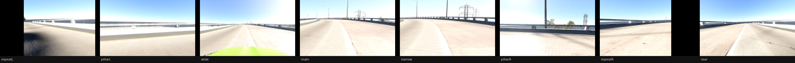
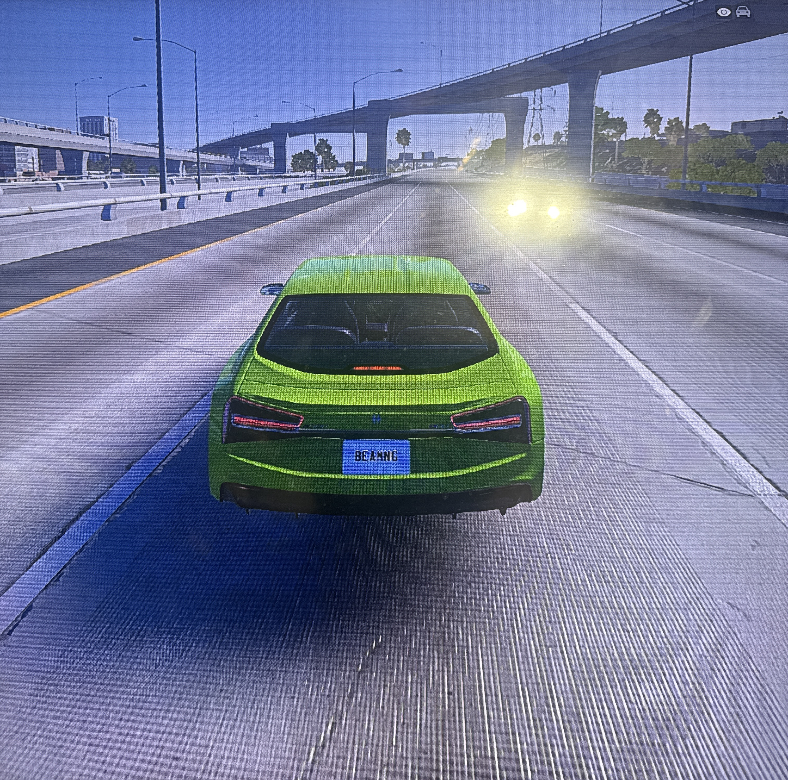
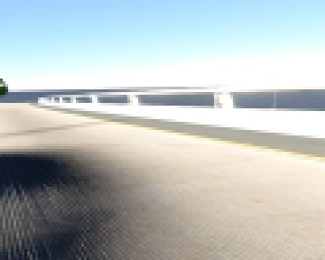
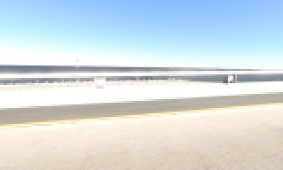
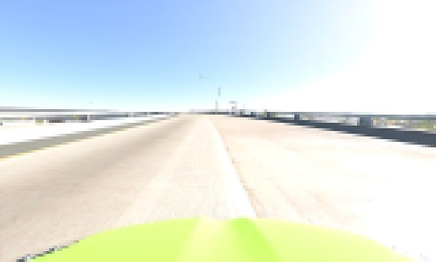
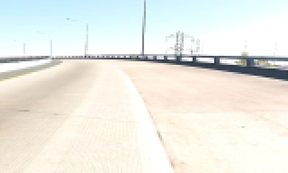
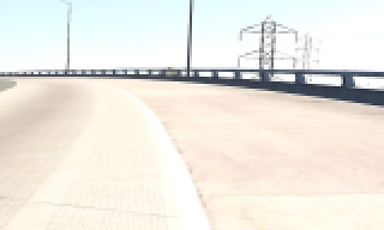
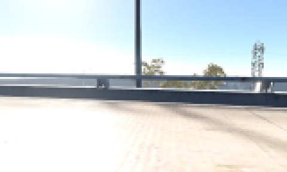
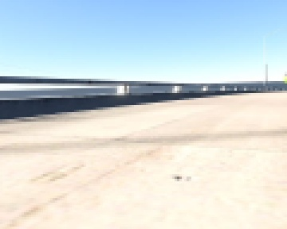
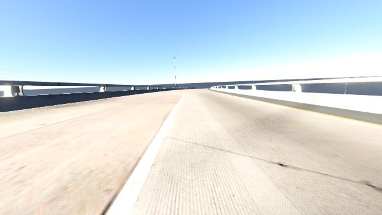

# Grok Vision Drive (GVD)

Grok Vision Drive is a camera-only driving toy for BeamNG.drive and BeamNG.tech. It is for entertainment. It is not a controller for a real car, and it is not Tesla.

## How to start

Windows. You do not need an administrator account.

1. Quit BeamNG if it is open.
2. Double-click `install.bat`.
3. Start BeamNG again. In Mod Manager, enable **Grok Vision Drive**.
4. If Python 3 is missing, install it from python.org and tick **Add to PATH**.
5. Double-click `play_gvd.bat`. If it asks to install the Python packages, choose Yes. It also tries to open BeamNG.drive. If the game does not open, start it yourself.
6. In the game, press Esc, open **UI Apps**, and add **GVD**.
7. Press Alt+G, or use the GVD app, to engage. Steer, or press Alt+G again, to take over. In the GVD VISION window, press `q` to quit.

BeamNG.tech is separate. Start BeamNG.tech yourself, then double-click `play_gvd_tech.bat`.

## Cameras

The strip is one picture made from all eight cameras. This is what the driving model sees. Left to right: repeatL, pillarL, wide, main, narrow, pillarR, repeatR, rear.

The settled game view. Soft Esc parked.

### repeatL

### pillarL

### wide

### main

### narrow

### pillarR

### repeatR

### rear

## Recent changes (alpha 1.7.11)

Catch-up from **1.0.1**. Each feature merge since that pin is one main step. The throttle fix is the point in between. Live Alt+G, Tech 8-cam, FFB, and QSV stay **UNPROVEN**.

## Still in force from 1.0.1

- A leftover `gvd_engage.json` `engaged:true` does not start the car. Python honors that flag only while its timestamp is about 2.5 s fresh. Lua refreshes the stamp every 0.5 s while the in-game latch is on, and will not write true over a newer supervisor false.
- `--policy e2e` with no `models/e2e_current.onnx` holds the brake (`veto:e2e_stub`) and stays engaged. Shadow keeps the modular command.
- `cmd_applied` is true only when the Lua ack is this `seq` or up to 5 behind.
- Retail stays one window (`cams=1/8`). Tech 8-cam is the other product. `--backend auto` does not pick Tech because `beamngpy` imports.

## 1.1.0 cabin

- Agent boxes are empty solids. LEAD and BRAKE stay. The forecast is a thin line with no disc and no bright center. The app, the strip, and the GVD VISION title share one glance word: OFF / ON / HOLD / DRIVE / MISMATCH.

## 1.2.0 draw range

- Cabin ground, lanes, curbs, signs, and agent boxes follow the camera far distance, ahead of the car and behind it. The chase camera stays just behind the car. The ice corridor ends where the path ends.

## 1.3.0 Tech hold

- Tech attach waits until the research port is listening, the mod is unpacked, a vehicle is spawned, and the lua bus is fresh. It does not start a second BeamNG.tech.

## 1.4.0 lanes and CAMS

- Yellow and white lane lines both count. A CAMS slot keeps its last good frame instead of going blank. A missing camera stays labelled missing.

## 1.4.1 own throttle and Neutral

- Engage no longer treats GVD's own throttle echo as the driver lifting off. A hold does not leave the gearbox in reverse.

## 1.5.0 companion cameras

- The companion cameras stay on their own side of the car. The rear overlay is the rear camera only. Lane paint follows the fit instead of a copied neighbour.

## 1.6.0 predicted path

- Soft Esc follows a predicted path for lanes, cars, signs, and lights, including where the cameras cannot see them yet. The wheel angle is not the path.

## 1.7.0 lane points and bus engage

- A drawn lane follows the points that were seen or predicted, then stops. It does not continue in a straight line, and it does not invent a fan of extra lanes. One lane stays one lane.
- A boundary that closes on the ego pair is a merge. One that opens is an exit. A parallel line stays a through lane.
- The kerb sits 0.4 m outside the outermost real line on that side. It is predicted, not detected.
- The ice ribbon is a point at the car center and opens to the car's width by the nose, then follows the path.
- Pillar cameras aim 68 degrees off the lane, so a turn can see traffic on the cross street. Fender cameras aim 160 degrees, back along the next lane, so the ego body is only at the frame edge.
- A click in a resized GVD VISION window hits the row under the pointer. That row shows a hover edge.
- Key `R`, or the VIZ-tab **review capture** row, writes each tick under `Documents/GVD/review/<UTC stamp>/`. The json has the lanes and their roles, the path points, steer, throttle, brake, engage, the glance word, and the disengage reason, plus a jpeg per camera. Capture does not stop BeamNG.tech.
- One slow grab no longer marks the link stale. The link window is 1.5 s. A low loop or camera rate does not drop Engage, and it does not zero a steer command that was already steady.
- Tech drive is arcade. A hold, a stop, or AEB sets the parking brake and releases the service brake, so gear 0 plus a held brake is not reverse.
- `python scripts/bot_engage.py on` writes `gvd_bot_engage.json` in the live bus folder. `off` clears it. A new `on` counts only while its timestamp is about 2.5 s old, then the latch stays on. A leftover true does not start the car. A driver override or a veto that already drops Engage clears the latch. BeamNG.tech stays up.

## 1.7.1 camera grid

- The CAMS tab is a 3×3 with an empty center, and the camera views on that tab are dimmed a little.

## 1.7.3 side cameras

- Pillar yaws turn 10 degrees further back, from 68 to 78. Fender repeaters move 0.15 m back so less of the car is in frame.

## 1.7.4 wheel rotation

- Disengage uses wheel rotation against the commanded steer. Force-feedback torque is not a signal. An echo of a command already ahead of the wheel is residual 0, a later smaller command keeps that catch-up inside the span, and a held rotation of 0.25 drops Engage.

## 1.7.5

Lane pieces that do not meet stay separate polylines, so a gap is not drawn as a kink. A curve that is one line still draws.

## 1.7.6

Delivered rig frames stitch left to right around the car as repeatL, pillarL, wide, main, narrow, pillarR, repeatR, rear. A missing camera is an empty sector. Seams are gaps, with no pose warp. Pillar yaw stays ±78° and repeater mounts stay at Y 1.30. The hardcoded E2E model reads that stitch. Repeater ego-body pixels are not another vehicle. The lane fit reads the windshield band of that stitch when the band has pixels, in the same road meters as one camera, and the main camera when that band is empty. Drawn lane lines run past the blue path.

## 1.7.7

A sun-blown camera colour buffer is matched to the viewport picture once, on the frame the lane fit, the model, the CAMS tiles, and the PIP all read. Near-white pavement comes down to mid gray and a thin lane stripe stays separable from the road. A frame that is already mid gray is left as it is. A missing or all-zero camera stays empty.

Companion colour is a shared-memory read of an offscreen sensor update. It does not send an ad-hoc render request. That request is the one bad game frame: the road shadow goes brighter and blue together, then the next game frame is the settled gray road again. A red/blue channel swap is not that frame. If a companion buffer still arrives as that bright-blue shadow, it is not stored; the settled frame stays. The hitch is unchanged: main every tick, one companion on its slot, last frame kept in between.

Tech control leaves the gearbox in arcade. `vehicle.control` has no gear field, because that field is `shiftToGearIndex` and arcade's `shiftToGearIndex` sets realistic. The repeating drive arm releases the parking brake and the clutch. It does not call `setGearboxMode`. Arcade is armed once at engage. Retail queues `drivetrain.setShifterMode(2)` once per vehicle. Mode 2 is arcade.

A bright gray hood is not the road sample. Mid-gray asphalt under that hood stays mid gray, and the lane fit keeps the lanes it had. The companion flash check reads the buffer before the tone curve. A washed companion that is not the blue flash is tone-matched and stored. The attach log prints the sensor `requested_update_time` (1 s for a yaml hitch of -1). Companions are that offscreen `stream_raw`.

The tone sample is the road under the sky and above the hood. Sky (190, 200, 210) over asphalt (128, 118, 108) stays mid gray with a dark hood, the lane fit stays at 2 lanes, and that sky stays off the white-paint mask.

## 1.7.8 repeater mounts

Fender repeaters move closer to the body, lower, and slightly back. repeatL is X -0.81, Y 1.25, Z 0.67, yaw -150. repeatR is X 0.81, Y 1.25, Z 0.67, yaw 150. The aim is 10 degrees farther out from the car than 160, still more rear than side. They still ignore only the ego car. Pillar and rear cameras stay put. Narrow and main stay put. The wide camera keeps its aim. Its picture widens from 4:3 to 16:9.

## 1.7.11 engaged steer

While Engage is on in BeamNG.tech, the car follows the controller steer. `vehicle.control` does not carry steering on that path, so a wheel held at an angle stays the grab signal. A physical wheel sitting at center leaves the controller steer in place. The wheel angle is still read. A held rotation of 0.25 away from the command drops Engage, and that held angle drives the car again without waiting for the wheel to move. While the hold is on and the wheel echo is missing, the grab baseline is 0, so that 0.25 is the grab. If the steer-hold queue does not land, the command stays unapplied and the next tick still omits steering. Quit, a supervisor exit, or a dead supervisor gives the wheel back. Unload retries the release and leaves `tech_steer_hold` true on disk until a release queue succeeds. When an angle and a lock type sit beside the stored wheel value, the release uses them; otherwise the replay is Direct Drive filter 2, angle 900, lock type 0. Point 1.7.10 is the open cameras pull request, so this fix is 1.7.11.

## 1.7.9 around the car

One supervisor tick reads all eight cameras, then builds the stitch. A camera from an older tick is not reused. Pillar, repeater, and rear lane pixels use that camera's pose, so a side pixel lands beside the car and a rear pixel lands behind it. The steer tick can use those points. Drawn lane lines follow the real points past the blue path and stop where the lane cannot be seen or predicted.

## Alpha 1.7.11

This is **alpha** — may break / not work; improves with fixes.

Canonical pin **1.7.11** (`VERSION`, `python/__init__.py`, BeamNG `app.json`). Untagged retail zips use `1.7.11-alpha-<sha>`. 1.7.10 is the open cameras pull request.

**Versioning** (this line stays **alpha** until a later non-alpha release):

- **point** bumps (`1.7.x`) = fixes / small UI
- **main alpha** bump (`1.x.0`) = features / core / UI overhaul

## Technical detail

### One picture

The rig is laid left to right as repeatL, pillarL, wide, main, narrow, pillarR, repeatR, rear. Seams are empty gaps. There is no overlap calibration and no pose warp. A missing camera stays an empty sector and is not filled from another camera. The inboard edge of repeatL is the image left, and the inboard edge of repeatR is the image right. Those columns are the ego body. They are cleared, and they are not another vehicle.

The model reads that strip as one picture. Both image slots carry the same strip. The lane fit reads the windshield band, wide then main then narrow, on the forward ground map when that band has pixels. Pillar, repeater, and rear sectors on the same strip become lane points through each camera's pose. An empty windshield band is fit on the main camera.

Pillar cameras aim 78 degrees off the lane. Repeater yaw is ±150, mounted at Y 1.25, back along the next lane. The three windshield cameras aim straight ahead. The rear camera aims straight back.

### Lane lines

With a blue path in the frame, a drawn lane follows its own points past that path, including points beside and behind the car. A line that still ends short of the path continues on its last heading until it passes the path. That extra point is the same piece. It stops where the lane cannot be seen or predicted, not out at the cabin span. A line that already passes the path is not lengthened. With no blue path, nothing is added past the last sample. A curve stays a curve.

### Companion cameras and colour

Each grab reads all eight cameras from shared memory on that tick. A camera that was not read this tick is missing. An older frame is not reused. A zero buffer is not stored.

Companion cameras are not requested with an ad-hoc render. That render steps the game view's exposure for one frame, and the shadows go bright blue. Companions update offscreen. The grab reads their shared memory.

The companion check runs before the tone curve. A buffer that is both brighter and bluer than the settled frame, by 18 levels on each, is not stored. Main is not put through that check. A washed companion that is not that flash is tone-matched and stored.

A sun-blown colour buffer is matched once, on the frame the lane fit, the model, the camera tiles, and the picture-in-picture read. The sample is the road trapezoid under the sky and above the hood. The hood is not the road sample. A frame whose road is already mid gray is left as it is.

### Arcade

Engage arms arcade once. A failed arm is retried on a later tick. The release does not latch the drive arm, and the handoff restores arcade for the player. The control message omits gear. Throttle releases the parking brake and the clutch. A hold, a stop, or AEB sets the parking brake and releases the service brake. The drive arm releases the parking brake and the clutch, and it leaves the gearbox mode alone. Retail queues shifter mode 2 once per vehicle. Mode 2 is arcade.

### Training strip

The scene recorder writes one 2272×192 JPEG for each tick that arrives, and one `state.jsonl` line with that timestamp, the seconds since the previous strip, ego, wheel, and pedals. Tech labels are on the line when the tick has them. The file keeps the machine's own rate. 5 Hz is what this desktop is expected to record, and it is not a requirement of the file. A camera that missed the tick is an empty sector. A tick whose picture timestamps disagree is refused.

The vision window LIVE tab has Start recording and Stop recording. The status shows recording on or recording off. Recording keeps going while Engage is on, and Engage does not start or stop it. The folder is remembered across restarts, including a path on another drive. Starting again only adds files under new names. Free up space does nothing until Confirm, and Confirm deletes the training files in that folder only. Stop, a restart, and a destination change leave the old files where they are.

Six sectors are 256×192 (repeatL, pillarL, main, narrow, pillarR, repeatR). Wide and rear are 340×192. Seven gaps are 8 px. The scene net crops those sectors, letterboxes the wide ones to 256×192, and steps a GRU with the real seconds since the previous strip. It predicts lanes, curbs, cars, signs, and lights, including ones the cameras cannot fully see. The hardcoded path planner turns that scene into the path and remains the driver. Training is `python -m python.train.train_scene`. It leaves BeamNG running. Compute 6.1 stays FP32. Compute 7.0 and newer select automatic mixed precision. Both export the same ONNX graph, `models/e2e_scene.onnx`. Wheel and pedals can drop a bad moment from the loss. They are not a loss term. Before the first step the trainer measures the strip directory and free VRAM and shrinks the batch until the step fits. When the card cannot hold one step and the machine has more CPU RAM, training uses the CPU and the window marks that path not recommended. A fit on the GPU stays on the GPU. The window updates time left, loss, learning rate, steps per second, and VRAM or RAM in use. It also shows recorded hours and minutes, summed from each line's dt_s in that folder. A new session is included. An empty folder shows 0 hours 0 minutes. The panel uses the supervisor's dark ground, ice type, and row spacing. Its loss graph is the steps of this run. Before a run it shows the recorded duration and sits idle.

### Credits

GVD uses these outside projects. Each one is its authors' work.

- [BeamNG.drive](https://www.beamng.com/). Retail play captures the BeamNG.drive window.
- [BeamNG.tech](https://beamng.tech/). The eight-camera session runs in BeamNG.tech.
- [BeamNGpy](https://github.com/BeamNG/BeamNGpy). Tech sessions, cameras, and electrics use BeamNGpy.
- [NumPy](https://numpy.org/). Frames and the planner math are NumPy arrays.
- [OpenCV](https://opencv.org/). The vision window, strip JPEGs, lane fit, and training panel use OpenCV.
- [PyYAML](https://pyyaml.org/). Config files are loaded with PyYAML.
- [PyTorch](https://pytorch.org/). Scene-net training and ONNX export use PyTorch.
- [ONNX](https://onnx.ai/). The exported scene graph and the detector files are ONNX.
- [ONNX Runtime](https://onnxruntime.ai/). Play time runs those graphs with ONNX Runtime.
- [Ultralytics](https://github.com/ultralytics/ultralytics). The shipped YOLOv8n detector is an Ultralytics checkpoint, and the ultra path loads it with their library.
- [YOLOX](https://github.com/Megvii-BaseDetection/YOLOX). An optional detector path reads a Megvii YOLOX ONNX file.
- [Foxglove SDK](https://github.com/foxglove/foxglove-sdk). An optional live view publishes with the Foxglove SDK.
- [BetterCam](https://github.com/RootKit-Org/BetterCam). Windows window capture uses BetterCam.
- [mss](https://github.com/BoboTiG/python-mss). Window capture uses mss when BetterCam is unavailable.
- [pywin32](https://github.com/mhammond/pywin32). Windows matches the BeamNG window title with pywin32.
- [FFmpeg](https://ffmpeg.org/). Review clips are encoded with FFmpeg when it is on PATH.

GVD's license is MIT (`LICENSE`). Detector weight notices are in `models/NOTICE.txt`.
